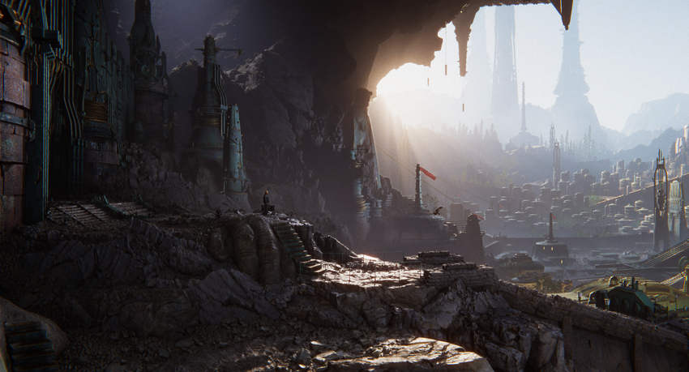

`Graphics`__
============
.. __: https://docs.unity3d.com/2020.3/Documentation/Manual/Graphics.html

Unity的图形功能可让你控制你的应用程序外观且高度可定制。你可以使用Unity的图形功能在各种平台（从手机到高端主机PC）创建精美经过优化的图形效果。

本章包含以下图形功能的详细信息：

.. toctree::
   :maxdepth: 2

   render_pipelines
   CamerasOverview
   PostProcessingOverview
   LightingOverview
   comp_MeshGroup
   Textures
   Shaders
