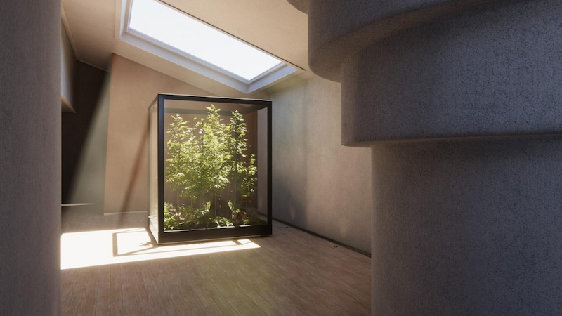

`Render pipelines`__
--------------------
.. __: https://docs.unity3d.com/2020.3/Documentation/Manual/render-pipelines.html

渲染管线执行一系列获取场景内容的操作，并把它们显示到屏幕。

在Unity中你可以选择不同的渲染管线。Unity提供三种了不同功能与性能预建渲染管线，或者你也可以创建你自己的渲染管线。

本节本节包含以下信息：

.. toctree::
   :maxdepth: 2

   render_pipelines_overview
   srp_setting_render_pipeline_asset
   built_in_render_pipeline
   universal_render_pipeline
   high_definition_render_pipeline
   ScriptableRenderPipeline
   srp_custom
